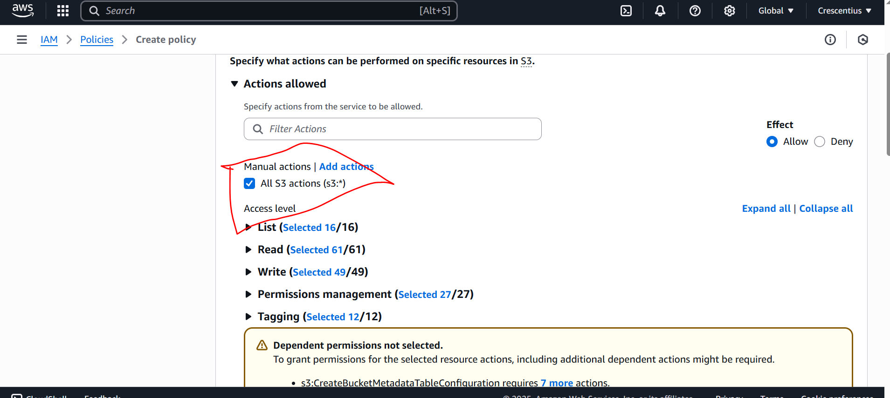
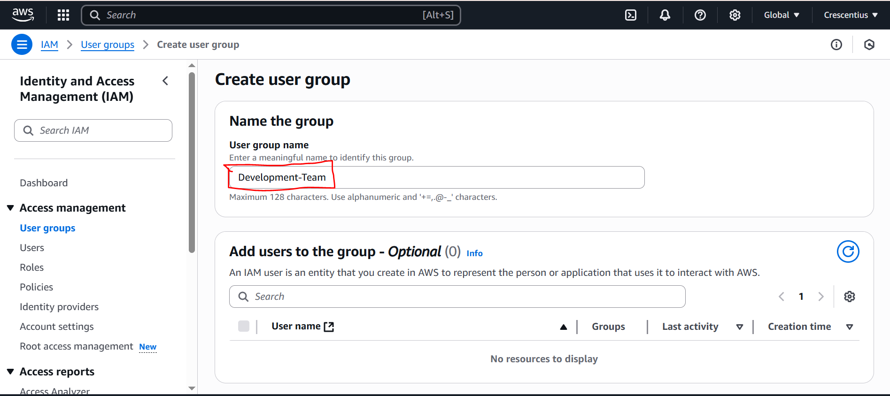

# Identity_And_Access_Management

## Introduction
This project focuses on setting up IAM user for Zappy E-Bank.

The goal is to set up IAM user for Backend developer, John, and Data analyst, Mary.

As a developer, John requires acces to servers (EC2), to run his codes, neccessitating IAM user with policies granting access to EC2.

As a data analyst, Mary requires access to data storage (S3 services), which means her IAM user policies should give her access to S3 services.

## Project Details

1. ### Create Policy for Development Team

    1. Logged into AWS, and in the IAM console, I clicked on create policy.
    

    2. In the select a service section, I searched for and selected EC2.
    

    3. Selected "All EC2 actions"
    

    4. Selected "All" in the resource section
    

    5. Clicked "Next" and prodided the name of the policy "Developers". Then I clicked "Create Policy".
    

    This was how the Developers policy was created.

2. ### Create Policy for Data Analyst

This same process for Developers policy was used, but instead of EC2, S3 was selected and the name "Analyst" was used instead of "Developers".

3. ### Create Group for the Development Team

    1. In the IAM console navigation, I selected "User group" and clicked "Create group"

    2. Provided a name for the group "Development-Team"
    

    3. Attached the "Developers" policy to the group.
    

    Development-Team group is created.

4. ### Create Group for Data Analyst Team

The same process for the Development-Team was used. The name of the group is "Analyst-Team" and the "Analyst-Policy" was attached.

5. ### Creating IAM User for John

    1. Navigated to the IAM dashboard, selected "Users" and clicked "Create"
    

    2. Provided the name of the user, "John"; and granted access to AWS management console.
    

    3. Added John to "Development-Team" group
    

    4. Clicked "Create User"; and downloaded John's login credentials
    

6. ### Creating IAM User for Mary

The same process as for John, but Mary is added to Analyst-Team group

7. ### Setting MFA

    1. Clicked on "User", clicked on "John"

    2. Clicked on "Enable MFA"
    

    3. Entered a device name for John's MFA and selected Passkeys and security keys to complete the setup.
    

    The same process was used to setup Mary's MFA too.